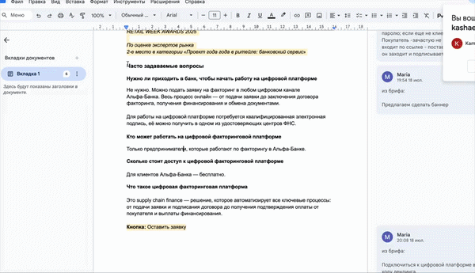

# Text2Layers

[](https://www.figma.com/community)
[](LICENSE)

**Text2Layers** — advanced Figma plugin for **bulk text layer manipulation**. Automates repetitive text editing across multiple layers, saving hours of manual work.




## ✨ **Features**

| Feature | Description |
|---------|-------------|
| **Bulk Fill** | Distributes multi-line text across selected layers (1 line = 1 layer) |
| **Smart Fill** | Copies **first line** to **ALL** selected layers |
| **Capitalization** | Uppercase first letter of each line |
| **Text Cleanup** | Removes end punctuation (.,:;) |
| **Typography** | Art. Lebedev Studio typographer («quotes», em dash, ellipsis…) |
| **Live Monitoring** | Real-time layer/line count tracking |

## 🚀 **Quick Start**

```bash
1. Select text layers in Figma
2. Plugins → Text2Layers  
3. Paste text into input field
4. Toggle checkboxes for processing options
5. Click "Insert Text"

```

## 🔧 **Development Setup**

```bash
# Clone repository
git clone https://github.com/mfd/text2layers.git
cd text2layers

# Figma: Plugins → Development → "Import plugin from manifest..."
# Select manifest.json

```
## 🤝 **License**

[MIT License](LICENSE) — free to use in commercial projects!

## 👨‍💻 **Author**

**Kamil Kashaev** — [GitHub](https://github.com/mfd)  
**Made with ❤️ for Figma designers worldwide**


